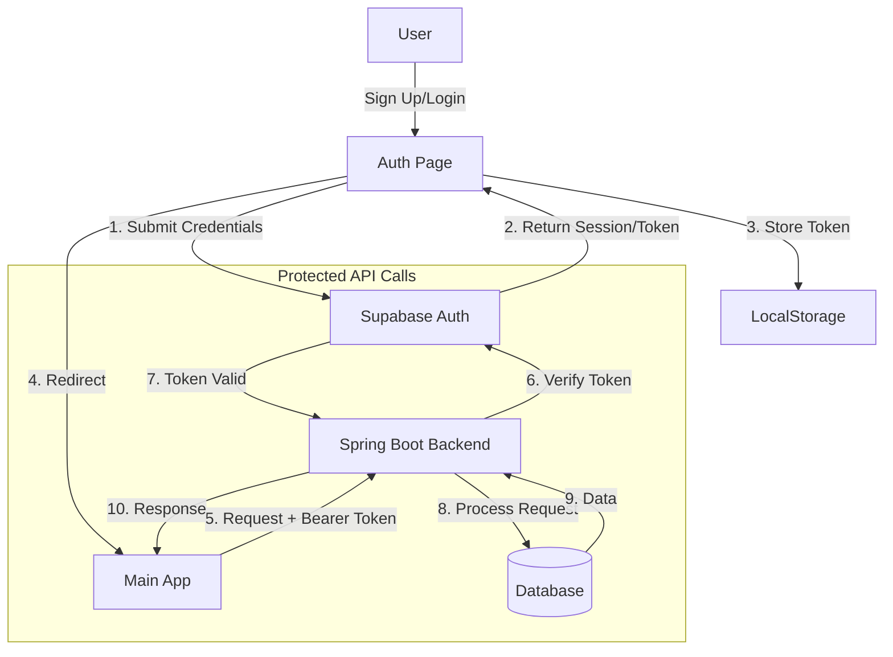
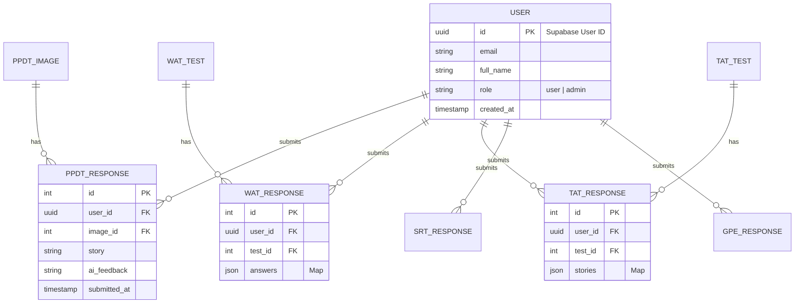

# SSB Mentor AI - Frontend

## 🚀 Overview
SSB Mentor AI is a comprehensive preparation platform for the Services Selection Board (SSB) interview. It provides tools and practice tests for various SSB stages, including PPDT, WAT, SRT, TAT, and GPE, along with AI-driven feedback.

## 🛠️ Tech Stack
This project is built using modern web technologies for performance and scalability.

-   **Core Framework:** [React.js](https://react.dev/) (v19) with [Vite](https://vitejs.dev/)
-   **Styling:** [Tailwind CSS](https://tailwindcss.com/) (v4)
-   **UI Components:** [Shadcn/UI](https://ui.shadcn.com/) (Radix UI + Lucide React)
-   **State & Cache Management:** [TanStack Query](https://tanstack.com/query) (React Query)
-   **Routing:** [React Router DOM](https://reactrouter.com/) (v7)
-   **Authentication:** [Supabase Auth](https://supabase.com/docs/guides/auth)
-   **HTTP Client:** [Axios](https://axios-http.com/)

---

## 🔐 Authentication Flow
The application uses Supabase for authentication, handling Login, Signup, and Password Recovery securely.



## 🗄️ Database Schema (Inferred)
The application manages Users, Tests (PPDT, TAT, WAT, etc.), and their Responses.



### Key Files
-   `src/lib/supabaseClient.js`: Initializes Supabase client.
-   `src/lib/authApi.js`: Centralized auth functions (login, signup, reset).
-   `src/lib/AuthCallback.jsx`: Handles redirects from magic links and OAuth.
-   `src/lib/AuthContext.jsx`: Global provider for user session state.
-   `src/pages/auth/ResetPassword.jsx`: Secure password update handling.

---

## 📡 API Endpoints
The frontend communicates with a backend service (e.g., Spring Boot/Python) via REST API.
**Base URL:** `VITE_API_BASE_URL` or `https://ssb-backend-production-a40d.up.railway.app`

### 📝 WAT (Word Association Test)
| Method | Endpoint | Description |
| :--- | :--- | :--- |
| `GET` | `/wat/user/tests/names` | Fetch available WAT tests |
| `GET` | `/wat/user/tests/{id}` | Fetch specific WAT test details |
| `POST` | `/wat/admin/tests` | Create new WAT test (Admin) |
| `PATCH` | `/wat/admin/tests/{id}` | Update WAT test (Admin) |
| `DELETE` | `/wat/admin/tests/{id}` | Delete WAT test (Admin) |

### 🖼️ PPDT (Picture Perception & Discussion Test)
| Method | Endpoint | Description |
| :--- | :--- | :--- |
| `GET` | `/ppdt/samples` | Get sample PPDT images |
| `GET` | `/ppdt/test/images` | Get test images |
| `POST` | `/ppdt/submit` | Submit PPDT response |

*(Other modules like TAT, SRT, GPE follow similar patterns)*

---

## 🗺️ Route Structure
The application uses `React Lazy` for performance optimization.

```mermaid
graph LR
    Root[/] --> Auth[/auth/*]
    Root --> Practice[/practice/*]
    Root --> Admin[/admin/*]
    
    subgraph "Public / User"
    Root --> H[Home]
    Root --> L[Lecturettes]
    Root --> N[News]
    end

    subgraph "Auth"
    Auth --> Login
    Auth --> VerifySuccess
    Auth --> ResetPassword
    end

    subgraph "Practice Modules"
    Practice --> PPDT
    Practice --> WAT
    Practice --> TAT
    Practice --> SRT
    Practice --> GPE
    Practice --> OIR
    end

    subgraph "Admin"
    Admin --> AddImage
    Admin --> EditTests
    end
```

### Main Routes
-   `/` - Home
-   `/auth/callback` - Auth Redirection Handler
-   `/practice/ppdt` - PPDT Module
-   `/tat` - TAT Module
-   `/wat` - WAT Module
-   `/srt` - SRT Module
-   `/gpe` - GPE Module
-   `/pi` - Personal Interview
-   `/admin/*` - Protected Admin Routes

---

## 💻 Installation & Setup

1.  **Clone the repository**
    ```bash
    git clone https://github.com/A4anas3/SSBMentorAI.git
    cd front
    ```

2.  **Install Dependencies**
    ```bash
    npm install
    ```

3.  **Environment Setup**
    Create a `.env` file in the root directory:
    ```env
    VITE_SUPABASE_URL=your_supabase_url
    VITE_SUPABASE_ANON_KEY=your_supabase_anon_key
    VITE_API_BASE_URL=your_backend_url
    ```

4.  **Run Development Server**
    ```bash
    npm run dev
    ```

5.  **Build for Production**
    ```bash
    npm run build
    ```
